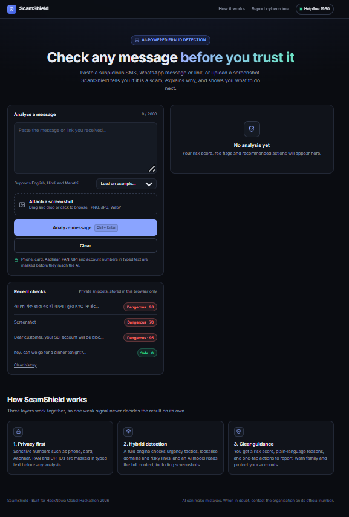
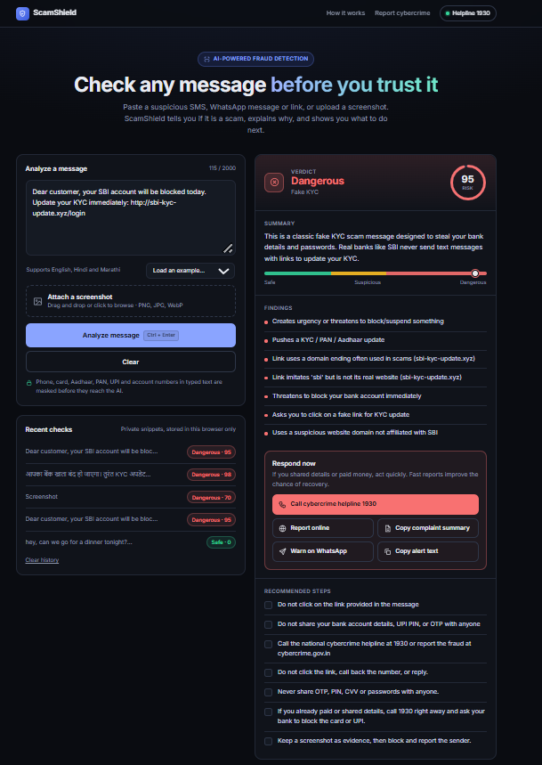
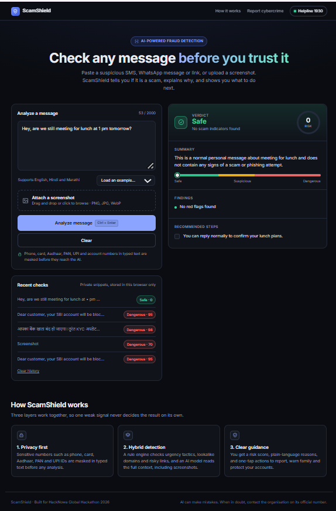
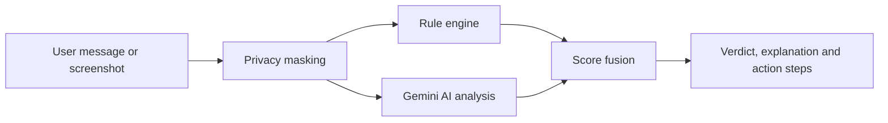

# 🛡️ ScamShield

**AI-powered scam and phishing detection for India.** Paste a suspicious SMS, WhatsApp message or link, or upload a screenshot. ScamShield tells you if it is a scam, explains why in simple language, and shows you what to do next.

**Live demo:** https://scamshield-6hdo.onrender.com  
**Demo video:** https://drive.google.com/file/d/1j7-NRmukA7CNFlcgonrlsfiiNeGGPedp/view?usp=sharing
 
**Problem statement:** Digital Safety & Cybersecurity (HackNowa Global Hackathon 2026)



## The problem

Online fraud in India is growing fast: fake KYC and bank messages, UPI collect-request tricks, fake courier and customs notices, task-based job scams, "digital arrest" calls and investment groups. Victims are often first-time or elderly users who have no quick way to verify a message before they act on it. Many scams are lost in minutes, so help has to be instant and easy to understand.

## What ScamShield does

- **Analyzes text, links and screenshots** of SMS and WhatsApp messages
- **Gives a risk score (0 to 100) and a verdict:** Safe, Suspicious or Dangerous
- **Explains the red flags** in plain language
- **Responds in the message's language** (English, Hindi, Marathi, Hinglish)
- **Guides the next step:** one-tap call to the 1930 cybercrime helpline, link to cybercrime.gov.in, a ready-made complaint summary, and a WhatsApp warning to share with family
- **Protects privacy:** phone, card, Aadhaar, PAN, UPI and account numbers in typed text are masked before they reach the AI

| Dangerous result | Safe result |
|---|---|
|  |  |

## How it works



1. **Privacy masking:** regex patterns replace sensitive numbers and IDs in typed text with placeholders.
2. **Rule engine:** checks urgency and threat language, requests for OTP or PIN, KYC and prize bait, shortened links, risky domain endings, raw IP links and lookalike domains that imitate banks and wallets.
3. **AI analysis:** a Gemini model reads the full context (and screenshots) and returns structured JSON with a score, scam type, red flags and advice. Message content is treated as untrusted data to resist prompt injection.
4. **Score fusion:** final score = 75% AI score + 25% rule score. If the AI is unavailable, the app falls back to the rule engine instead of failing.

## Evaluation

We tested on a hand-written, India-focused set of **50 messages (29 scams, 21 legitimate)**, including tricky legitimate messages such as real bank OTP and debit alerts.

| System | Accuracy | Scams caught | False alarms |
|---|---|---|---|
| Rules only | 70.0% | 48.3% (14 of 29) | 0.0% |
| **ScamShield (rules + AI)** | **100%** | **100% (29 of 29)** | **0.0%** |

The AI layer catches scams that keyword rules miss, such as impersonation, "reply YES" job lures and Hindi or Hinglish messages. The test set is small and written by the team, so these numbers show direction rather than a production benchmark. Reproduce them with `python backend/evaluate.py`.

## Tech stack

- **Backend:** Python, FastAPI
- **AI:** Google Gemini API (free tier), structured JSON output, multimodal screenshot reading
- **Frontend:** HTML, CSS and vanilla JavaScript (no build step)
- **Deployment:** Render

## Run it locally

```bash
git clone https://github.com/Akanksha120606/scamshield
cd scamshield/backend
python -m venv venv
venv\Scripts\activate            # Windows (use: source venv/bin/activate on Mac/Linux)
pip install -r requirements.txt
```

Create `backend/.env` (see `backend/.env.example`):

```
GEMINI_API_KEY=your-key-from-aistudio.google.com
GEMINI_MODEL=gemini-3.8-flash
GEMINI_FALLBACK_MODELS=gemini-3.7-flash,gemini-3.5-flash-lite,gemini-3.1-flash-lite
```

Start the server and open http://127.0.0.1:8000

```bash
uvicorn main:app --reload
```

## Limitations and next steps

- Typed text is masked before analysis, but **screenshots are sent to the AI as-is**, so users are told to crop out private details.
- Masking uses pattern matching, so it hides numbers and IDs but not names or addresses.
- The free hosting tier sleeps when idle, so the first load can take about a minute.
- AI can make mistakes. ScamShield is an aid, not a guarantee, and users should confirm through official channels.
- **Next:** live URL reputation feeds (Google Safe Browsing, PhishTank), voice-call scam detection, a WhatsApp or Telegram bot, and more Indian languages.

## Project structure

```
backend/   FastAPI app, rule engine, privacy masking, Gemini client, evaluation scripts
frontend/  Single-page web app served by the backend
docs/      Screenshots
```

Built by Akanksha Borkar for the HackNowa Global Hackathon 2026.